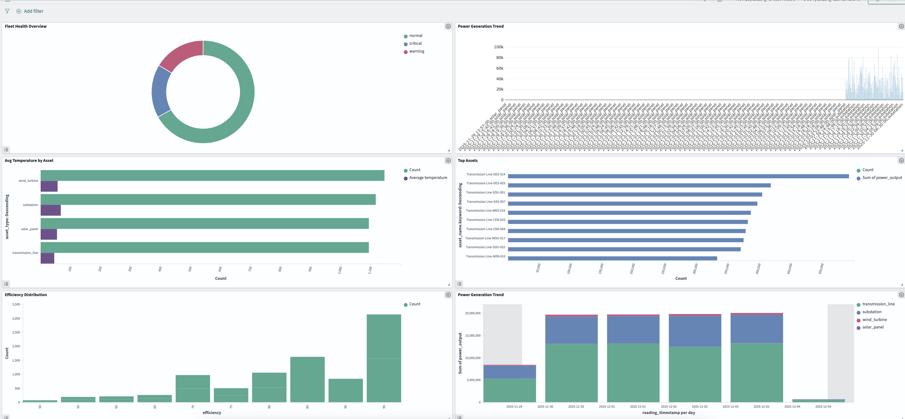
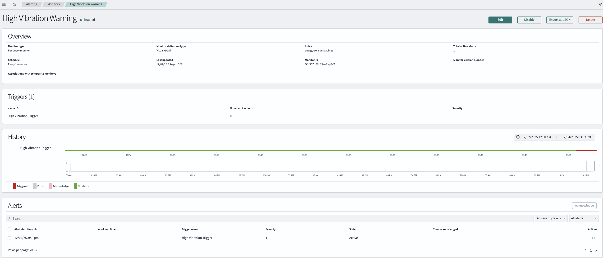

# OpenSearch for Energy Sector: Real-Time Visibility & Intelligent Search

**From Data Overload to Actionable Insights**

---

## The Challenge: When Millions of Sensor Readings Aren't Enough

Picture this: It's 2:47 AM at PowerGrid Energy's control center. An operator notices a sudden dip in power output from the North Wind Farm cluster. They need answers—fast.

- *Which specific turbines are affected?*
- *Is this a weather event or equipment failure?*
- *Are there similar patterns from other facilities?*
- *What happened the last time we saw this behavior?*

With **8,500 sensors** generating **51,000 readings per minute**, the data exists. But finding the needle in this haystack of 73 million daily readings? That's where traditional databases struggle.

**This is why the energy sector needs OpenSearch.**

---

## Why OpenSearch for Energy Operations?

### The Problem with Traditional Approaches

Your current architecture handles data storage well:

| System | Strength | Limitation |
|--------|----------|------------|
| **Cassandra** | Fast writes, operational queries | No full-text search, limited aggregations |
| **Iceberg** | Historical analytics, ML-ready | Batch-oriented, not real-time |
| **watsonx.data** | Complex SQL, federated queries | Limited visualization, no alerting |

But energy operations need something more:

- **Instant search** across billions of records
- **Real-time dashboards** updating every second
- **Intelligent alerting** before problems escalate
- **Pattern discovery** to find "similar events"

### What OpenSearch Brings to the Table

OpenSearch is a **search and analytics engine** purpose-built for these challenges:

| Capability | Energy Use Case |
|------------|-----------------|
| **Sub-second search** | Find all turbine failures in the last hour across 100 wind farms |
| **Real-time aggregations** | Show current power output by region, updating live |
| **Geo-spatial queries** | Map all assets within 50km of a storm system |
| **Full-text search** | Search maintenance logs: "gearbox vibration" |
| **Anomaly detection** | Automatically flag unusual sensor patterns |
| **Alerting** | Notify on-call engineer when temperature exceeds threshold |

---

## A Day in the Life: How OpenSearch Transforms Energy Operations

### 6:00 AM — The Control Room Operator

**Maria** starts her shift at the grid operations center. Her OpenSearch dashboard shows:

```
┌─────────────────────────────────────────────────────────────────┐
│  Morning Shift Dashboard - December 3, 2024                     │
├─────────────────────┬───────────────────┬───────────────────────┤
│  TOTAL GENERATION   │  FLEET HEALTH     │  ACTIVE ALERTS        │
│     4,247 MW        │     94.2%         │     3 warnings        │
│     ▲ 12% vs 6AM    │     (target: 95%) │     0 critical        │
├─────────────────────┴───────────────────┴───────────────────────┤
│                    ASSET MAP (Live)                              │
│    [Online: 8,247]    [Warning: 241]    [Offline: 12]           │
│    [Interactive map showing all facilities]                      │
├─────────────────────────────────────────────────────────────────┤
│  POWER BY REGION (Last 24 Hours)                                │
│  ████████████████████ North: 1,842 MW                           │
│  ██████████████ South: 1,203 MW                                 │
│  ██████████ Central: 847 MW                                     │
│  ███████ Coastal: 355 MW                                        │
└─────────────────────────────────────────────────────────────────┘
```

She clicks on a warning indicator for Wind Farm North-7. OpenSearch instantly returns:

> **3 turbines showing elevated vibration** (7.2-7.8 mm/s vs normal 3-4 mm/s)
> - Turbine-N7-023: Started 47 minutes ago
> - Turbine-N7-024: Started 52 minutes ago  
> - Turbine-N7-025: Started 44 minutes ago
>
> **Similar historical pattern found**: December 2023, same turbines, root cause was ice accumulation on blades.

This correlation—finding patterns across months of historical data in milliseconds—is what makes OpenSearch invaluable.

### 10:30 AM — The Field Engineer

**Carlos** receives an alert on his mobile device:

> **Maintenance Prediction Alert**
> 
> Asset: Solar-Facility-East-12, Panel Array B3
> Issue: Efficiency dropped 23% over 72 hours
> Probable cause: Soiling (no rain in 8 days, dust index high)
> Recommendation: Schedule cleaning within 48 hours
> Estimated generation loss if delayed: 847 kWh/day

Carlos opens the maintenance dashboard on his tablet. He searches:

```
"efficiency drop" AND region:East AND asset_type:solar_panel AND last_7_days
```

OpenSearch returns 17 similar cases, sorted by severity. He can now plan an optimized cleaning route for the maintenance crew.

### 3:00 PM — The Executive

**Sarah**, VP of Operations, needs to present quarterly performance to the board. She opens the Executive Dashboard:

```
┌─────────────────────────────────────────────────────────────────┐
│  Q4 2024 Performance Summary                                    │
├─────────────────────────────────────────────────────────────────┤
│                                                                  │
│  GENERATION vs TARGET          AVAILABILITY                      │
│  ┌────────────────────┐        ┌────────────────────┐           │
│  │ Target: 12,500 GWh │        │      97.3%         │           │
│  │ Actual: 12,847 GWh │        │   (Best quarter    │           │
│  │    [+2.8%]         │        │    in 3 years)     │           │
│  └────────────────────┘        └────────────────────┘           │
│                                                                  │
│  COST PER MWh (Trend)          TOP PERFORMING REGIONS           │
│  ┌────────────────────┐        1. North Wind: 102% of target    │
│  │ $32.40 → $28.70    │        2. Coastal Solar: 98% of target  │
│  │    ▼ 11.4%         │        3. Central Grid: 96% of target   │
│  └────────────────────┘                                         │
│                                                                  │
│  [Export to PDF] [Schedule Report] [Drill Down by Region]       │
└─────────────────────────────────────────────────────────────────┘
```

She clicks "Drill Down by Region" and OpenSearch instantly aggregates 3 months of data across 8,500 assets—something that would take minutes in a traditional database.

---

## Can OpenSearch be Added to watsonx.data?

### Current State (December 2024)

**Direct integration is not yet available.** watsonx.data does not currently have a native OpenSearch connector.

### The Good News

IBM joined the **OpenSearch Software Foundation as a Premier Member** in 2024. This signals commitment to future integration:

- Native OpenSearch connector in watsonx.data
- Federated queries spanning Iceberg and OpenSearch
- Unified data governance across both platforms

### Today's Architecture

Until native integration arrives, OpenSearch runs alongside your existing stack:

```
                    ┌─────────────────────────────────┐
                    │      Sensor Devices (8,500)     │
                    │   Wind • Solar • Substations    │
                    └───────────────┬─────────────────┘
                                    │
                    ┌───────────────▼─────────────────┐
                    │         Cassandra (HCD)          │
                    │    Operational Data (hours)      │
                    │    • 51,000 writes/minute        │
                    │    • Real-time status queries    │
                    └───────────────┬─────────────────┘
                                    │
              ┌─────────────────────┼─────────────────────┐
              │                     │                     │
              ▼                     ▼                     ▼
┌─────────────────────┐ ┌─────────────────────┐ ┌─────────────────────┐
│   Iceberg (MinIO)   │ │     OpenSearch      │ │   watsonx.data      │
│                     │ │                     │ │                     │
│ Historical Archive  │ │ Search & Dashboards │ │ Federated Analytics │
│ • Years of data     │ │ • Real-time viz     │ │ • Complex SQL       │
│ • ML training       │ │ • Full-text search  │ │ • Query both DBs    │
│ • Compliance        │ │ • Alerting          │ │ • AI/ML prep        │
└─────────────────────┘ └─────────────────────┘ └─────────────────────┘

         │                        │                      │
         │                        │                      │
         ▼                        ▼                      ▼
    Data Science            Operations Center        Business Analytics
    & ML Models             & Field Teams            & Reporting
```

**Each system has its role:**

| System | Primary Users | Key Value |
|--------|--------------|-----------|
| **Cassandra** | Applications, real-time pipelines | Fastest writes, operational queries |
| **Iceberg** | Data scientists, compliance | Historical depth, ML-ready format |
| **OpenSearch** | Operators, field engineers | Search, dashboards, alerts |
| **watsonx.data** | Analysts, executives | Complex SQL across all sources |

---

## Part 1: Setting Up OpenSearch

### Deploy with Docker Compose

1. **Create the OpenSearch directory:**

```bash
mkdir -p ~/opensearch && cd ~/opensearch
```

2. **Create `docker-compose.yml`** by copying the **Sample Docker Compose file for development** from the official OpenSearch documentation:

   **[OpenSearch Docker Compose for Development](https://docs.opensearch.org/latest/install-and-configure/install-opensearch/docker/#sample-docker-compose-file-for-development)**

   This configuration includes:
   - Two OpenSearch nodes in a cluster
   - OpenSearch Dashboards
   - Security disabled for development simplicity
   - Proper memory and ulimit settings

3. **Set required kernel parameter** (OpenSearch requires this):

```bash
sudo sysctl -w vm.max_map_count=262144

# Make it permanent (survives reboot)
echo "vm.max_map_count=262144" | sudo tee -a /etc/sysctl.conf
```

4. **Start the services:**

```bash
cd ~/opensearch
docker compose up -d

# Wait for startup (30-60 seconds)
sleep 30

# Verify health
curl "http://localhost:9200/_cluster/health?pretty"
```

> **Note**: The sample Docker Compose file disables security for development. For production deployments, enable the security plugin and configure TLS.

### Configure SSH Tunnel (Remote Access)

Add OpenSearch ports to your existing SSH tunnel. Open a **new terminal** on your Mac and run:

```bash
ssh -i your-key.pem -N \
  -L 9200:localhost:9200 \
  -L 5601:localhost:5601 \
  ec2-user@your-ec2-public-ip
```

> **Note**: The `-N` flag keeps the tunnel open without starting a shell. Keep this terminal running while you access OpenSearch.

**Access Points:**
- **OpenSearch Dashboards**: http://localhost:5601
- **OpenSearch API**: http://localhost:9200

---

## Part 2: Loading Energy Sensor Data

### Understanding the Data Model

Before loading data, let's understand what we're indexing. Each sensor reading contains:

| Field Category | Fields | Purpose |
|---------------|--------|---------|
| **Identifiers** | asset_id, reading_id, facility_id | Link readings to physical assets |
| **Location** | region, facility_name, latitude, longitude | Geographic analysis & mapping |
| **Measurements** | power_output, voltage, current, temperature, vibration_level | Equipment performance |
| **Environment** | wind_speed, solar_irradiance, ambient_temperature | External conditions |
| **Status** | operational_status, alert_level, efficiency | Health indicators |

### Create the Index with Energy-Optimized Mappings

This index schema is designed for energy sector queries:

```bash
curl -X PUT "http://localhost:9200/energy-sensor-readings" -H 'Content-Type: application/json' -d'
{
  "settings": {
    "number_of_shards": 3,
    "number_of_replicas": 1,
    "index.refresh_interval": "5s"
  },
  "mappings": {
    "properties": {
      "asset_id": { "type": "keyword" },
      "asset_name": { 
        "type": "text",
        "fields": { "keyword": { "type": "keyword" } }
      },
      "asset_type": { "type": "keyword" },
      "facility_id": { "type": "keyword" },
      "facility_name": { 
        "type": "text",
        "fields": { "keyword": { "type": "keyword" } }
      },
      "region": { "type": "keyword" },
      "reading_timestamp": { "type": "date" },
      "reading_id": { "type": "keyword" },
      
      "power_output": { "type": "float" },
      "voltage": { "type": "float" },
      "current": { "type": "float" },
      "temperature": { "type": "float" },
      "vibration_level": { "type": "float" },
      "frequency": { "type": "float" },
      "power_factor": { "type": "float" },
      
      "ambient_temperature": { "type": "float" },
      "wind_speed": { "type": "float" },
      "solar_irradiance": { "type": "float" },
      
      "operational_status": { "type": "keyword" },
      "alert_level": { "type": "keyword" },
      "efficiency": { "type": "float" },
      "capacity_factor": { "type": "float" },
      
      "location": { "type": "geo_point" }
    }
  }
}'
```

**Why these choices?**
- `keyword`: Exact matching for filters (region, asset_type, alert_level)
- `text` with `keyword` subfield: Full-text search + exact aggregations (asset_name, facility_name)
- `geo_point`: Enables map visualizations and distance queries
- `float`: Efficient numeric storage for measurements

### Option A: Generate Sample Data (Quick Demo)

Use this script to quickly generate 7 days of sample energy sensor data:

```bash
# Install dependencies
pip3 install opensearch-py

# Run the generator
python3 scripts/generate_sample_data.py
```

**What it generates:**
- 7 days of historical data
- 1,000 readings per day (7,000 total)
- 4 asset types: wind_turbine, solar_panel, substation, transmission_line
- 10 facilities across different regions
- Realistic power output, temperature, efficiency values
- Alert levels: normal, warning, critical

---

### Option B: Load Data from Cassandra

**Python Script (Best for Production)**

```python
#!/usr/bin/env python3
"""
sync_to_opensearch.py - Load energy sensor data into OpenSearch

This script demonstrates the ETL pattern for energy sector data:
1. Extract from Cassandra (operational database)
2. Transform for search optimization (add geo_point, denormalize)
3. Load into OpenSearch (search & visualization layer)
"""

from cassandra.cluster import Cluster
from opensearchpy import OpenSearch, helpers
from datetime import datetime
import sys

# Configuration - update these for your environment
CASSANDRA_HOST = '<your-ec2-private-ip>'  # EC2 private IP
OPENSEARCH_HOST = 'localhost'              # localhost via SSH tunnel

def connect_cassandra():
    """Connect to Cassandra cluster"""
    cluster = Cluster([CASSANDRA_HOST])
    session = cluster.connect('energy_ks')
    print(f"✓ Connected to Cassandra at {CASSANDRA_HOST}")
    return cluster, session

def connect_opensearch():
    """Connect to OpenSearch cluster"""
    client = OpenSearch(
        hosts=[{'host': OPENSEARCH_HOST, 'port': 9200}],
        http_compress=True,
        use_ssl=False,
        verify_certs=False
    )
    # Test connection
    info = client.info()
    print(f"✓ Connected to OpenSearch {info['version']['number']}")
    return client

def fetch_sensor_readings(session, batch_size=10000):
    """
    Fetch sensor readings from Cassandra.
    
    In production, you'd typically:
    - Filter by time range for incremental loads
    - Use token-aware pagination for large datasets
    """
    query = f"SELECT * FROM sensor_readings_by_asset LIMIT {batch_size}"
    print(f"  Fetching up to {batch_size:,} readings from Cassandra...")
    return session.execute(query)

def transform_for_opensearch(row):
    """
    Transform a Cassandra row into an OpenSearch document.
    
    Key transformations:
    - Convert UUIDs to strings (OpenSearch doesn't support UUID type)
    - Create geo_point from lat/lon for map visualizations
    - Format timestamp for OpenSearch date type
    """
    doc = {
        '_index': 'energy-sensor-readings',
        '_id': str(row.reading_id),  # Use reading_id as document ID for upserts
        '_source': {
            # Identifiers
            'asset_id': str(row.asset_id),
            'asset_name': row.asset_name,
            'asset_type': row.asset_type,
            'facility_id': str(row.facility_id),
            'facility_name': row.facility_name,
            'region': row.region,
            'reading_id': str(row.reading_id),
            
            # Timestamp
            'reading_timestamp': row.reading_timestamp.isoformat() if row.reading_timestamp else None,
            
            # Sensor measurements
            'power_output': row.power_output,
            'voltage': row.voltage,
            'current': row.current,
            'temperature': row.temperature,
            'vibration_level': row.vibration_level,
            'frequency': row.frequency,
            'power_factor': row.power_factor,
            
            # Environmental data
            'ambient_temperature': row.ambient_temperature,
            'wind_speed': row.wind_speed,
            'solar_irradiance': row.solar_irradiance,
            
            # Status
            'operational_status': row.operational_status,
            'alert_level': row.alert_level,
            'efficiency': row.efficiency,
            'capacity_factor': row.capacity_factor,
            
            # Geo-location (for maps)
            'location': {
                'lat': row.latitude,
                'lon': row.longitude
            } if row.latitude and row.longitude else None
        }
    }
    return doc

def load_to_opensearch(opensearch_client, rows):
    """
    Bulk load documents into OpenSearch.
    
    Uses the bulk API for efficiency - much faster than individual inserts.
    """
    def generate_actions():
        count = 0
        for row in rows:
            yield transform_for_opensearch(row)
            count += 1
            if count % 10000 == 0:
                print(f"  Processed {count:,} documents...")
        print(f"  Total processed: {count:,} documents")
    
    print("  Loading into OpenSearch...")
    success, failed = helpers.bulk(
        opensearch_client,
        generate_actions(),
        chunk_size=1000,
        request_timeout=60
    )
    return success, failed

def main():
    print("\n" + "="*60)
    print("Energy Sensor Data → OpenSearch Sync")
    print("="*60 + "\n")
    
    # Connect to data sources
    cassandra_cluster, cassandra_session = connect_cassandra()
    opensearch_client = connect_opensearch()
    
    print("\nStep 1: Extracting from Cassandra")
    rows = fetch_sensor_readings(cassandra_session, batch_size=100000)
    
    print("\nStep 2: Transforming and Loading to OpenSearch")
    success, failed = load_to_opensearch(opensearch_client, rows)
    
    print("\n" + "="*60)
    print(f"✓ Sync Complete!")
    print(f"  Documents indexed: {success:,}")
    print(f"  Failed: {failed}")
    print("="*60 + "\n")
    
    # Cleanup
    cassandra_cluster.shutdown()

if __name__ == "__main__":
    main()
```

**Run the sync:**

```bash
# Install pip (if not already installed)
sudo yum install python3-pip -y

# Install dependencies
pip3 install cassandra-driver opensearch-py

# Run the sync script
python3 sync_to_opensearch.py
```

### Option C: Spark Job (Best for Large-Scale Production)

For production workloads with millions of records, use Spark:

```java
// Add to pom.xml:
// <dependency>
//     <groupId>org.opensearch.client</groupId>
//     <artifactId>opensearch-spark-30_2.12</artifactId>
//     <version>1.2.0</version>
// </dependency>

package com.ibm.wxd.datalabs.demo.cass_spark_iceberg;

import org.apache.spark.sql.Dataset;
import org.apache.spark.sql.Row;
import org.apache.spark.sql.SparkSession;
import static org.apache.spark.sql.functions.*;

/**
 * Spark ETL job to sync Iceberg data to OpenSearch.
 * 
 * This enables real-time dashboards on top of historical data.
 */
public class IcebergToOpenSearch {
    
    public static void main(String[] args) {
        SparkSession spark = SparkSession.builder()
            .appName("Energy Data to OpenSearch")
            .config("spark.sql.catalog.spark_catalog", "org.apache.iceberg.spark.SparkCatalog")
            .config("spark.sql.catalog.spark_catalog.type", "hadoop")
            .config("spark.sql.catalog.spark_catalog.warehouse", "s3a://iceberg-bucket/")
            .getOrCreate();
        
        System.out.println("Reading from Iceberg...");
        
        Dataset<Row> sensorData = spark.read()
            .format("iceberg")
            .load("spark_catalog.energy_data.sensor_readings");
        
        // Add geo_point structure for OpenSearch maps
        Dataset<Row> enrichedData = sensorData
            .withColumn("location", 
                when(col("latitude").isNotNull().and(col("longitude").isNotNull()),
                    struct(col("latitude").alias("lat"), col("longitude").alias("lon")))
                .otherwise(lit(null)));
        
        System.out.println("Writing to OpenSearch...");
        
        enrichedData.write()
            .format("org.opensearch.spark.sql")
            .option("opensearch.nodes", "<your-ec2-private-ip>")
            .option("opensearch.port", "9200")
            .option("opensearch.resource", "energy-sensor-readings")
            .option("opensearch.mapping.id", "reading_id")
            .option("opensearch.write.operation", "upsert")
            .mode("append")
            .save();
        
        System.out.println("✓ Sync complete!");
        spark.stop();
    }
}
```

### Verify Data Load

```bash
# Check document count
curl -X GET "http://localhost:9200/energy-sensor-readings/_count?pretty"

# Sample a few documents
curl -X GET "http://localhost:9200/energy-sensor-readings/_search?size=3&pretty"
```

---

## Part 3: Building Operational Dashboards

Now the exciting part—turning data into visual insights that drive decisions.



### Access OpenSearch Dashboards

Open http://localhost:5601 in your browser.

### Step 1: Create Index Pattern

Before creating visualizations, tell Dashboards about your data:

1. Click the **Menu** (hamburger icon) in the top left
2. Go to **Management** → **Dashboards Management** → **Index patterns**
3. Click **Create index pattern**
4. Enter `energy-sensor-readings` as the pattern
5. Click **Next step**
6. Select `reading_timestamp` as the time field
7. Click **Create index pattern**

### Step 2: Build Visualizations

> **Important**: Use the **Visualize Library** (not Observability Explorer) to create reusable visualizations that can be saved separately.

1. Click **Menu** → **OpenSearch Dashboards** → **Visualize**
2. Click **Create visualization**
3. Choose your visualization type
4. Select index: `energy-sensor-readings`
5. Configure and **Save with a unique name**

---

#### Visualization 1: Power Generation Trend (Vertical Bar)

1. **Menu** → **Visualize** → **Create visualization**
2. Select **Vertical Bar**
3. Select index: `energy-sensor-readings`
4. Configure:

| Section | Setting |
|---------|---------|
| **Metrics** | Y-axis → Aggregation: `Sum`, Field: `power_output` |
| **Buckets** | X-axis → Aggregation: `Date Histogram`, Field: `reading_timestamp`, Interval: `Daily` |
| **Buckets** | Add → Split Series → Aggregation: `Terms`, Field: `asset_type` |

5. Click **Apply changes**
6. **Save** → Name: `Energy - Power Generation Trend`

---

#### Visualization 2: Fleet Health Overview (Pie Chart)

1. **Menu** → **Visualize** → **Create visualization**
2. Select **Pie**
3. Select index: `energy-sensor-readings`
4. Configure:

| Section | Setting |
|---------|---------|
| **Metrics** | Slice Size → Aggregation: `Count` |
| **Buckets** | Split Slices → Aggregation: `Terms`, Field: `alert_level` |

5. Click **Apply changes**
6. **Save** → Name: `Energy - Fleet Health Overview`

---

#### Visualization 3: Average Temperature by Asset Type (Horizontal Bar)

1. **Menu** → **Visualize** → **Create visualization**
2. Select **Horizontal Bar**
3. Select index: `energy-sensor-readings`
4. Configure:

| Section | Setting |
|---------|---------|
| **Metrics** | Y-axis → Aggregation: `Average`, Field: `temperature` |
| **Buckets** | X-axis → Aggregation: `Terms`, Field: `asset_type` |

5. Click **Apply changes**
6. **Save** → Name: `Energy - Avg Temperature by Asset`

---

#### Visualization 4: Power Output by Facility (Vertical Bar)

1. **Menu** → **Visualize** → **Create visualization**
2. Select **Vertical Bar**
3. Select index: `energy-sensor-readings`
4. Configure:

| Section | Setting |
|---------|---------|
| **Metrics** | Y-axis → Aggregation: `Sum`, Field: `power_output` |
| **Buckets** | X-axis → Aggregation: `Terms`, Field: `facility_name`, Size: `10` |

5. Click **Apply changes**
6. **Save** → Name: `Energy - Power by Facility`

---

#### Visualization 5: Top Assets by Power Output (Horizontal Bar)

1. **Menu** → **Visualize** → **Create visualization**
2. Select **Horizontal Bar**
3. Select index: `energy-sensor-readings`
4. Configure:

| Section | Setting |
|---------|---------|
| **Metrics** | Y-axis → Aggregation: `Sum`, Field: `power_output` |
| **Buckets** | X-axis → Aggregation: `Terms`, Field: `asset_name`, Size: `10` |
| **Buckets** | (same row) Order By: `metric: Sum of power_output`, Order: `Descending` |

5. Click **Apply changes**
6. **Save** → Name: `Energy - Top Assets`

---

#### Visualization 6: Efficiency Distribution (Vertical Bar)

1. **Menu** → **Visualize** → **Create visualization**
2. Select **Vertical Bar**
3. Select index: `energy-sensor-readings`
4. Configure:

| Section | Setting |
|---------|---------|
| **Metrics** | Y-axis → Aggregation: `Count` |
| **Buckets** | X-axis → Aggregation: `Histogram`, Field: `efficiency`, Interval: `5` |

5. Click **Apply changes**
6. **Save** → Name: `Energy - Efficiency Distribution`

---

### Quick Reference: All Visualizations

| # | Name | Type | Metric | Bucket |
|---|------|------|--------|--------|
| 1 | Energy - Power Generation Trend | Vertical Bar | Sum of `power_output` | Date Histogram (Daily) on `reading_timestamp` + Split by `asset_type` |
| 2 | Energy - Fleet Health Overview | Pie | Count | Terms on `alert_level` |
| 3 | Energy - Avg Temperature by Asset | Horizontal Bar | Average of `temperature` | Terms on `asset_type` |
| 4 | Energy - Power by Facility | Vertical Bar | Sum of `power_output` | Terms on `facility_name` (top 10) |
| 5 | Energy - Top Assets | Horizontal Bar | Sum of `power_output` | Terms on `asset_name` (top 10) |
| 6 | Energy - Efficiency Distribution | Vertical Bar | Count | Histogram on `efficiency` (interval 5) |

---

### Step 3: Assemble the Dashboard

1. **Menu** → **OpenSearch Dashboards** → **Dashboard**
2. Click **Create dashboard**
3. Click **Add**
4. Select each visualization you created:
   - Energy - Power Generation Trend
   - Energy - Fleet Health Overview
   - Energy - Avg Temperature by Asset
   - Energy - Power by Facility
   - Energy - Top Assets
   - Energy - Efficiency Distribution
5. Drag and resize panels to arrange the layout
6. Set time filter (top right): **Last 24 hours**
7. Click **Save** → Name: `Energy Operations Control Center`

---

## Part 4: Search Queries

Run these queries in **Dev Tools** (Menu → Management → Dev Tools).

---

### Query 1: Find All Alerts (Warning and Critical)

**What it does**: Returns all readings with warning or critical alert levels from the last 24 hours.

```json
GET energy-sensor-readings/_search
{
  "query": {
    "bool": {
      "must": [
        { "range": { "reading_timestamp": { "gte": "now-24h" } } }
      ],
      "should": [
        { "term": { "alert_level": "critical" } },
        { "term": { "alert_level": "warning" } }
      ],
      "minimum_should_match": 1
    }
  },
  "sort": [{ "reading_timestamp": "desc" }],
  "size": 100
}
```

---

### Query 2: High Temperature Assets

**What it does**: Finds all assets with temperature above 80°C in the last 7 days.

```json
GET energy-sensor-readings/_search
{
  "query": {
    "bool": {
      "must": [
        { "range": { "temperature": { "gte": 80 } } },
        { "range": { "reading_timestamp": { "gte": "now-7d" } } }
      ]
    }
  },
  "sort": [{ "temperature": "desc" }],
  "size": 50
}
```

---

### Query 3: High Vibration Assets

**What it does**: Finds all assets with vibration level above 6 (potential mechanical issues).

```json
GET energy-sensor-readings/_search
{
  "query": {
    "bool": {
      "must": [
        { "range": { "vibration_level": { "gte": 6 } } },
        { "range": { "reading_timestamp": { "gte": "now-7d" } } }
      ]
    }
  },
  "sort": [{ "vibration_level": "desc" }],
  "size": 50
}
```

---

### Query 4: Low Efficiency Assets

**What it does**: Finds all assets with efficiency below 70% (underperforming).

```json
GET energy-sensor-readings/_search
{
  "query": {
    "bool": {
      "must": [
        { "range": { "efficiency": { "lte": 70 } } },
        { "range": { "reading_timestamp": { "gte": "now-7d" } } }
      ]
    }
  },
  "sort": [{ "efficiency": "asc" }],
  "size": 50
}
```

---

### Query 5: Performance by Asset Type

**What it does**: Shows total power output, average efficiency, and average temperature grouped by asset type.

```json
GET energy-sensor-readings/_search
{
  "size": 0,
  "query": {
    "range": { "reading_timestamp": { "gte": "now-7d" } }
  },
  "aggs": {
    "by_asset_type": {
      "terms": { "field": "asset_type" },
      "aggs": {
        "total_power": { "sum": { "field": "power_output" } },
        "avg_efficiency": { "avg": { "field": "efficiency" } },
        "avg_temperature": { "avg": { "field": "temperature" } },
        "reading_count": { "value_count": { "field": "reading_id" } }
      }
    }
  }
}
```

---

### Query 6: Performance by Facility

**What it does**: Shows total power output and average efficiency grouped by facility name.

```json
GET energy-sensor-readings/_search
{
  "size": 0,
  "query": {
    "range": { "reading_timestamp": { "gte": "now-7d" } }
  },
  "aggs": {
    "by_facility": {
      "terms": { "field": "facility_name.keyword", "size": 20 },
      "aggs": {
        "total_power": { "sum": { "field": "power_output" } },
        "avg_efficiency": { "avg": { "field": "efficiency" } },
        "avg_temperature": { "avg": { "field": "temperature" } }
      }
    }
  }
}
```

---

### Query 7: Maintenance Priority List

**What it does**: Finds assets that need maintenance attention - high temperature, high vibration, or low efficiency - grouped by asset name with their worst readings.

```json
GET energy-sensor-readings/_search
{
  "size": 0,
  "query": {
    "bool": {
      "must": [
        { "range": { "reading_timestamp": { "gte": "now-24h" } } }
      ],
      "should": [
        { "range": { "temperature": { "gte": 75 } } },
        { "range": { "vibration_level": { "gte": 6 } } },
        { "range": { "efficiency": { "lte": 70 } } }
      ],
      "minimum_should_match": 1
    }
  },
  "aggs": {
    "problem_assets": {
      "terms": { 
        "field": "asset_name.keyword", 
        "size": 20,
        "order": { "max_temp": "desc" }
      },
      "aggs": {
        "max_temp": { "max": { "field": "temperature" } },
        "max_vibration": { "max": { "field": "vibration_level" } },
        "min_efficiency": { "min": { "field": "efficiency" } },
        "facility": { "terms": { "field": "facility_name.keyword", "size": 1 } }
      }
    }
  }
}
```

---

### Query 8: Daily Power Generation Trend

**What it does**: Shows total power output per day for the last 7 days, grouped by asset type.

```json
GET energy-sensor-readings/_search
{
  "size": 0,
  "query": {
    "range": { "reading_timestamp": { "gte": "now-7d" } }
  },
  "aggs": {
    "daily_power": {
      "date_histogram": {
        "field": "reading_timestamp",
        "calendar_interval": "day"
      },
      "aggs": {
        "total_power": { "sum": { "field": "power_output" } },
        "by_asset_type": {
          "terms": { "field": "asset_type" },
          "aggs": {
            "power": { "sum": { "field": "power_output" } }
          }
        }
      }
    }
  }
}
```

---

### Query Summary Table

| # | Query | What It Finds |
|---|-------|---------------|
| 1 | Find All Alerts | Warning and critical alert readings |
| 2 | High Temperature | Assets with temp > 80°C |
| 3 | High Vibration | Assets with vibration > 6 |
| 4 | Low Efficiency | Assets with efficiency < 70% |
| 5 | By Asset Type | Performance grouped by wind_turbine, solar_panel, etc. |
| 6 | By Facility | Performance grouped by facility name |
| 7 | Maintenance Priority | Assets needing attention, sorted by severity |
| 8 | Daily Trend | Power output trend over time |

---

## Part 5: Setting Up Intelligent Alerts

Don't wait for problems—let OpenSearch notify you proactively.



### Alert 1: High Temperature Warning

1. Go to **Menu** → **OpenSearch Plugins** → **Alerting**
2. Click **Create monitor**

**Step 1: Monitor Details**

| Setting | Value |
|---------|-------|
| Monitor name | `High Equipment Temperature` |
| Monitor type | `Per query monitor` |
| Monitor defining method | `Visual editor` |
| Frequency | `By interval`, Every `1` Minutes |

**Step 2: Data Source**

| Setting | Value |
|---------|-------|
| Index | `energy-sensor-readings` |
| Time field | `reading_timestamp` |

**Step 3: Query (Visual Editor)**

1. Click **Add filter**
2. Configure first filter:
   - Field: `temperature`
   - Operator: `is greater than`
   - Value: `85`
3. Set time range: `Last 5 minutes`

**Step 4: Create Trigger**

1. Click **Add trigger**
2. Configure:

| Setting | Value |
|---------|-------|
| Trigger name | `High Temp Alert` |
| Severity level | `1 (Highest)` |
| Trigger condition | `IS ABOVE 0` |

**Step 5: Add Action (Optional)**

1. Click **Add action**
2. Select destination (Slack, Email, etc.)
3. Message template:

```
HIGH TEMPERATURE ALERT

Assets reporting temperatures above 85°C detected.
Check the Energy Operations Dashboard for details.
```

4. Click **Create**

---

### Alert 2: Low Efficiency Warning

1. Go to **Alerting** → **Create monitor**

**Monitor Settings:**

| Setting | Value |
|---------|-------|
| Monitor name | `Low Efficiency Alert` |
| Monitor type | `Per query monitor` |
| Monitor defining method | `Visual editor` |
| Frequency | Every `5` Minutes |
| Index | `energy-sensor-readings` |
| Time field | `reading_timestamp` |

**Query Filter:**
- Field: `efficiency`
- Operator: `is less than`
- Value: `60`

**Trigger:**
- Trigger condition: `IS ABOVE 0`
- Severity: `2 (High)`

---

### Alert 3: High Vibration Warning

1. Go to **Alerting** → **Create monitor**

**Monitor Settings:**

| Setting | Value |
|---------|-------|
| Monitor name | `High Vibration Alert` |
| Monitor type | `Per query monitor` |
| Monitor defining method | `Visual editor` |
| Frequency | Every `1` Minutes |
| Index | `energy-sensor-readings` |
| Time field | `reading_timestamp` |

**Query Filter:**
- Field: `vibration_level`
- Operator: `is greater than`
- Value: `7`

**Trigger:**
- Trigger condition: `IS ABOVE 0`
- Severity: `1 (Highest)`

---

### Testing Alerts

To test alerts, run the streaming data generator:

```bash
# Install dependencies (if not already installed)
pip3 install opensearch-py

# Run the streaming data generator
python3 scripts/generate_streaming_data.py
```

This script sends new data every 5 seconds with some high temperature readings to trigger alerts.

---

## Part 6: Additional Dashboard Ideas

### Operations Control Center

| Panel | Type | Metric | Bucket |
|-------|------|--------|--------|
| Total Generation Now | Metric | Sum of `power_output` | - |
| Generation Trend | Area | Sum of `power_output` | Date Histogram |
| Fleet Status | Pie | Count | Terms on `operational_status` |
| Alert Summary | Pie | Count | Terms on `alert_level` |
| Active Alerts Table | Data Table | Count | Terms on `asset_name` (filter: `alert_level: warning OR critical`) |

### Maintenance Dashboard

| Panel | Type | Metric | Bucket |
|-------|------|--------|--------|
| Avg Efficiency Trend | Area | Average of `efficiency` | Date Histogram + Split by `asset_type` |
| High Vibration Assets | Data Table | Max of `vibration_level` | Terms on `asset_name` |
| Temperature by Asset | Horizontal Bar | Average of `temperature` | Terms on `asset_name` |
| Maintenance Priority | Data Table | Max of `temperature`, Max of `vibration_level` | Terms on `asset_name` |

### Executive Summary

| Panel | Type | Metric | Bucket |
|-------|------|--------|--------|
| Total Generation | Metric | Sum of `power_output` | - |
| Regional Comparison | Vertical Bar | Sum of `power_output` | Terms on `region` |
| Avg Efficiency | Gauge | Average of `efficiency` | - |
| Generation Over Time | Area | Sum of `power_output` | Date Histogram (daily) |

### Renewable Performance

| Panel | Type | Metric | Bucket |
|-------|------|--------|--------|
| Power by Asset Type | Pie | Sum of `power_output` | Terms on `asset_type` |
| Wind Speed vs Power | Line | Avg of `power_output`, Avg of `wind_speed` | Date Histogram |
| Solar Irradiance Impact | Area | Sum of `power_output` | Date Histogram (filter: `asset_type: solar_panel`) |
| Efficiency by Region | Horizontal Bar | Average of `efficiency` | Terms on `region` |

---

## Best Practices for Energy Sector Deployments

### Data Management

**Index Lifecycle Management** - Keep recent data fast, archive old data:

```json
PUT _ilm/policy/energy-sensor-policy
{
  "policy": {
    "phases": {
      "hot": {
        "min_age": "0ms",
        "actions": {
          "rollover": {
            "max_size": "50gb",
            "max_age": "1d"
          },
          "set_priority": { "priority": 100 }
        }
      },
      "warm": {
        "min_age": "7d",
        "actions": {
          "shrink": { "number_of_shards": 1 },
          "forcemerge": { "max_num_segments": 1 },
          "set_priority": { "priority": 50 }
        }
      },
      "cold": {
        "min_age": "30d",
        "actions": {
          "set_priority": { "priority": 0 }
        }
      },
      "delete": {
        "min_age": "90d",
        "actions": { "delete": {} }
      }
    }
  }
}
```

### Security (Production)

1. **Enable security plugin** - Authentication and TLS
2. **Role-based access**:
   - `operators`: Read dashboards, no data modification
   - `engineers`: Read/search data, manage alerts
   - `admins`: Full access
3. **Audit logging** - Track who accessed what data
4. **Network isolation** - OpenSearch on private subnet only

### Performance Optimization

1. **Shard sizing**: Aim for 10-50GB per shard
2. **Refresh interval**: 5-30 seconds based on dashboard needs
3. **Use date-based indices** for high-volume data: `energy-readings-2024.12.03`
4. **Pre-aggregate** metrics for historical dashboards

---

## The Complete Picture

Here's how OpenSearch fits into your energy data architecture:

| Layer | Technology | Purpose | Users |
|-------|------------|---------|-------|
| **Ingestion** | Cassandra | High-speed sensor writes | IoT gateways |
| **Analytics** | Iceberg + watsonx.data | Historical analysis, ML | Data scientists |
| **Visualization** | OpenSearch Dashboards | Real-time monitoring | Operations, executives |
| **Search** | OpenSearch | Find anything, fast | Everyone |
| **Alerting** | OpenSearch Alerting | Proactive notifications | Operations, maintenance |

**Together, these systems provide:**

- Sub-second writes (Cassandra)
- Petabyte-scale history (Iceberg)
- Complex SQL analytics (watsonx.data)
- Real-time dashboards (OpenSearch)
- Intelligent alerting (OpenSearch)
- Full-text search (OpenSearch)

---

## Next Steps

1. **Deploy OpenSearch** using the Docker Compose setup
2. **Load your data** using the Python script or Spark job
3. **Create the Operations Dashboard** first—immediate value for control room
4. **Set up critical alerts** for temperature and generation drops
5. **Train your team** on search queries and dashboard customization
6. **Schedule incremental syncs** from Cassandra/Iceberg to keep data fresh

---

## Resources

- **OpenSearch Documentation**: https://opensearch.org/docs/latest/
- **OpenSearch Dashboards Guide**: https://opensearch.org/docs/latest/dashboards/
- **Alerting Plugin**: https://opensearch.org/docs/latest/observing-your-data/alerting/
- **Anomaly Detection**: https://opensearch.org/docs/latest/observing-your-data/ad/
- **OpenSearch Community Forum**: https://forum.opensearch.org/

---

**Questions?** The combination of watsonx.data's analytical power with OpenSearch's visualization and search capabilities gives your energy operations complete visibility—from real-time monitoring to historical analysis to predictive insights.
