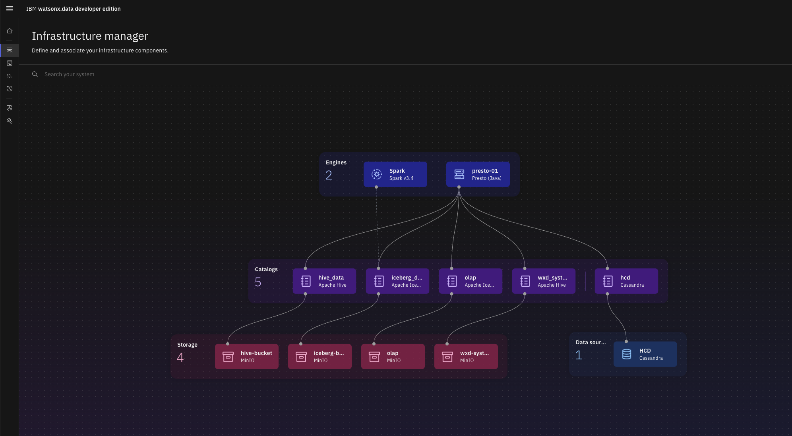
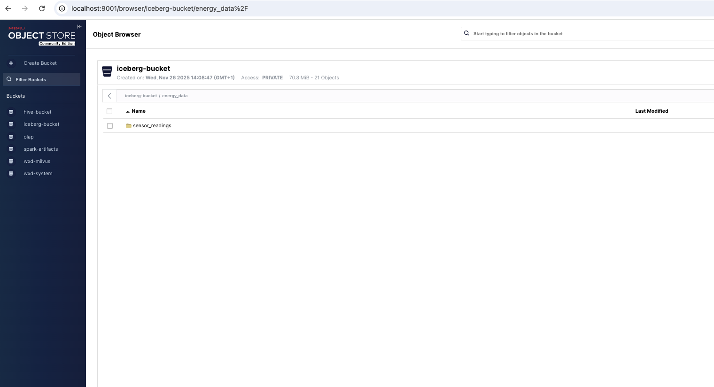
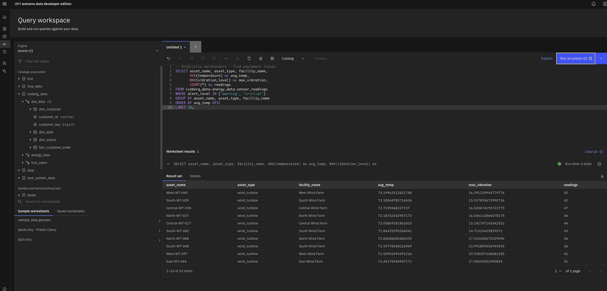

# Energy IoT Demo - Cassandra to Iceberg

**Real-time Energy Sector Analytics with IBM watsonx.data**

This demo shows how to handle IoT sensor data from energy infrastructure (wind turbines, solar panels, etc.) using Cassandra for operational data and Iceberg for analytics.

**Based on**: This version builds upon [wxd-spark-hcd](https://github.com/michelderu/wxd-spark-hcd) and [cass_spark_iceberg](https://github.ibm.com/pravin-bhat/cass_spark_iceberg/tree/main), updated for EC2 deployment and customized with Energy-sector examples.

---

## Table of Contents

- [Business Scenario](#business-scenario)
- [Why Two Databases?](#why-two-databases)
- [Architecture Overview](#architecture-overview)
- [Requirements](#requirements)
- [Setup Guide](#setup-guide)
- [Running the Demo](#running-the-demo)
- [Data Model Details](#data-model-details)
- [Understanding the Code](#understanding-the-code)
- [Business Value](#business-value)
- [Key Takeaways](#key-takeaways)
- [Optional: OpenSearch Dashboards](#optional-opensearch-dashboards)
- [Learn More](#learn-more)

---

## Business Scenario

**PowerGrid Energy** company operates distributed energy infrastructure:
- 5,000 wind turbines (100 wind farms across 10 regions)
- 2,000 solar panel arrays (50 solar facilities)  
- 500 substations (grid distribution)
- 1,000 transmission line monitors

Each asset sends sensor data every 10 seconds:
- Power generation/consumption
- Equipment health (temperature, vibration)
- Environmental conditions (wind, solar irradiance)
- Grid metrics (voltage, frequency)

### Data Volume

- **8,500 sensors** × 6 readings/minute = **51,000 readings/minute**
- **3.06 million readings/hour**
- **73.4 million readings/day**  
- **2.2 billion readings/month**


---

## Why Two Databases?

This demo uses two complementary data stores to handle different aspects of IoT data management. Each system is optimized for its specific role in the data pipeline.

**Cassandra handles operational data** - the recent sensor readings that need to be written and queried quickly. When you have 8,500 sensors sending data every 10 seconds (51,000 inserts per minute), you need a database that can handle high-velocity writes without breaking a sweat. Cassandra excels at this. It's designed for questions like "What's the current status of Turbine-North-001?" or "Show me all critical alerts from the last hour." This is the operational layer where monitoring dashboards and real-time alerting systems get their data.

**Iceberg handles historical analytics** - the long-term storage where months or years of data lives. Once operational data ages beyond a few days, it's moved to Iceberg for cost-effective storage and complex analysis. This is where you run queries like "What was average power output last month?" or "Which turbines need maintenance based on vibration trends over the past year?" Iceberg is also ideal for training machine learning models since you can access years of historical patterns without overwhelming your operational database.

Together, they form a complete solution: Cassandra keeps your operations running smoothly with real-time data access, while Iceberg provides the historical depth needed for strategic decisions and predictive analytics.

---

## Architecture Overview

```
┌─────────────────────┐
│   Sensor Devices    │  8,500 assets × 6 readings/minute
│ (Wind, Solar, etc)  │  = 51,000 readings/minute
└──────────┬──────────┘
           │
           ▼
┌─────────────────────┐
│   Cassandra (HCD)   │  Operational Database
│                     │  • Fast writes
│  energy_ks schema   │  • Recent data (hours/days)
│  sensor_readings    │  • Partitioned by (asset + time)
└──────────┬──────────┘
           │
           │ Spark ETL (optimized - 10-20x faster)
           ▼
┌─────────────────────┐
│  Iceberg (MinIO)    │  Analytics Storage
│                     │  • Historical data (months/years)
│  energy_data schema │  • Time partitioned
│  sensor_readings    │  • Open table format
└──────────┬──────────┘
           │
           ▼
┌─────────────────────┐
│   watsonx.data      │  Query Both!
│  (Presto Engine)    │  • Federated queries
│                     │  • Real-time + Historical
│  Query Workspace    │  • Single SQL interface
└─────────────────────┘
```

---

## Requirements

### Supported Platforms
- macOS (Intel or Apple Silicon)
- Windows 10/11 64-bit
- Linux (Ubuntu 20.04+, RHEL 8+)

### EC2 Instance
- **Type**: m5.2xlarge (8 vCPU, 32 GB RAM)
- **OS**: RHEL 8 or RHEL 9
- **Storage**: 100 GB minimum
- **Ports**: 22 (SSH), 9443 (watsonx.data)

### Software Required
- Docker/Podman - Container runtime
- Kubernetes - Container orchestration
- Java 11 or 17 - For DataStax HCD
- Maven - For building Java applications

---

## Setup Guide

### Step 1: Set Up EC2 and watsonx.data

#### Download & Install

1. **Launch EC2 instance** with specs above

2. **Install watsonx.data Developer Edition**:
   
   Follow the [IBM watsonx.data Developer Edition installation guide](https://www.ibm.com/docs/en/watsonxdata).
   
   This usually involves:
   - Downloading the Developer Edition installer
   - Running the setup script
   - Installing on Kubernetes (kind)

#### Verify Installation

Check that all pods are running correctly:

```bash
# View all pods
kubectl get pods -n wxd

# Count pods (should return 22 for Developer Edition)
kubectl get pods -n wxd | wc -l
```

Ensure all pods show `Running` status before proceeding.

#### Set Up Port Forwarding for watsonx.data UI

**On EC2**, run these commands to expose watsonx.data UI and MDS:

```bash
# Expose watsonx.data UI (port 9443)
export KUBECONFIG=~/.kube/config && nohup kubectl port-forward -n wxd service/lhconsole-ui-svc 9443:443 --address 0.0.0.0 > /dev/null 2>&1 &

# Expose MDS (Metadata Service - port 8381)
export KUBECONFIG=~/.kube/config && nohup kubectl port-forward -n wxd service/ibm-lh-mds-thrift-svc 8381:8381 --address 0.0.0.0 > /dev/null 2>&1 &
```

**From your laptop**, create SSH tunnel to access watsonx.data UI:

```bash
# Use EC2 PUBLIC IP or PUBLIC DNS (not private IP!)
# Using port 9444 locally to avoid conflicts with other services
ssh -i your-key.pem -L 9444:localhost:9443 -L 8381:localhost:8381 ec2-user@your-ec2-public-ip

# Example:
# ssh -i enel.pem -L 9444:localhost:9443 -L 8381:localhost:8381 ec2-user@ec2-51-20-76-129.eu-north-1.compute.amazonaws.com
```

**Note:** Use your EC2's **public IP** or **public DNS name** (found in AWS Console), not the private IP (172.31.x.x).

#### Access watsonx.data UI

**Open browser** → `https://localhost:9444` (watsonx.data UI)



*watsonx.data Infrastructure Manager showing engines, catalogs, storage, and data sources*

#### Install MinIO Client (mc)

**On EC2**, install the MinIO client:

```bash
# Download and install MinIO client
curl -O https://dl.min.io/client/mc/release/linux-amd64/mc
chmod +x mc
sudo mv mc /usr/local/bin/

# Verify installation
mc --version
```

#### Set Up Port Forwarding for MinIO

**On EC2**, run these commands to expose MinIO services:

```bash
# Expose MinIO Console (port 9001)
export KUBECONFIG=~/.kube/config && nohup kubectl port-forward -n wxd service/ibm-lh-minio-svc 9001:9001 --address 0.0.0.0 > /dev/null 2>&1 &

# Expose MinIO API (port 9000)
export KUBECONFIG=~/.kube/config && nohup kubectl port-forward -n wxd service/ibm-lh-minio-svc 9000:9000 --address 0.0.0.0 > /dev/null 2>&1 &
```

**From your laptop**, update your SSH tunnel to include MinIO ports:

```bash
# Exit existing SSH session (Ctrl+C or exit)
# Then reconnect with all ports (using EC2 PUBLIC IP):
ssh -i your-key.pem -L 9444:localhost:9443 -L 8381:localhost:8381 -L 9000:localhost:9000 -L 9001:localhost:9001 ec2-user@your-ec2-public-ip

# Example:
# ssh -i enel.pem -L 9444:localhost:9443 -L 8381:localhost:8381 -L 9000:localhost:9000 -L 9001:localhost:9001 ec2-user@ec2-51-20-76-129.eu-north-1.compute.amazonaws.com
```

#### Access MinIO (Object Storage)

Access MinIO Console at `http://localhost:9001`



**Developer Edition Default Credentials:**
- Username: `dummyvalue`
- Password: `dummyvalue`

**For other installations**, retrieve credentials from secrets:
```bash
kubectl get secret ibm-lh-minio-secret -n wxd -o jsonpath='{.data.accesskey}' | base64 -d && echo
kubectl get secret ibm-lh-minio-secret -n wxd -o jsonpath='{.data.secretkey}' | base64 -d && echo
```

Save these credentials - you'll need them to configure the MinIO client.

---

**Reference**: See the [IBM watsonx.data documentation](https://www.ibm.com/docs/en/watsonxdata) for more information.

**Note on Access Points**: 
- **watsonx.data UI from laptop**: `https://localhost:9444` (via SSH tunnel)
- **MinIO Console from laptop**: `http://localhost:9001` (via SSH tunnel)
- **MinIO API from laptop**: `http://localhost:9000` (via SSH tunnel)
- **From EC2**: Use `http://localhost:9000` and `http://localhost:9001` (kubectl port-forward)
- **From Spark jobs** (inside Kubernetes): `http://ibm-lh-minio-svc:9000` (internal service name)

### Step 2: Install Cassandra (DataStax HCD)

```bash
# Download HCD
cd ~
wget https://github.com/datastax/hyper-converged-database/releases/download/1.2.3/hcd-1.2.3-bin.tar.gz
tar -xzf hcd-1.2.3-bin.tar.gz
cd hcd-1.2.3
```

**Configure Cassandra to use EC2 private IP:**

```bash
# Get your EC2 private IP
EC2_PRIVATE_IP=$(hostname -I | awk '{print $1}')
echo "EC2 Private IP: $EC2_PRIVATE_IP"

# Edit cassandra.yaml
nano conf/cassandra.yaml
```

Update these settings in `cassandra.yaml`:

```yaml
# Change listen_address from localhost to EC2 private IP
listen_address: <your-ec2-private-ip>

# Change rpc_address from localhost to EC2 private IP
rpc_address: <your-ec2-private-ip>

# Set broadcast_rpc_address to EC2 private IP
broadcast_rpc_address: <your-ec2-private-ip>
```

Or use this one-liner to update automatically:

```bash
# Backup original config
cp conf/cassandra.yaml conf/cassandra.yaml.backup

# Get EC2 private IP
EC2_PRIVATE_IP=$(hostname -I | awk '{print $1}')

# Update configuration
sed -i "s/^listen_address:.*/listen_address: $EC2_PRIVATE_IP/" conf/cassandra.yaml
sed -i "s/^rpc_address:.*/rpc_address: $EC2_PRIVATE_IP/" conf/cassandra.yaml
sed -i "s/^# broadcast_rpc_address:.*/broadcast_rpc_address: $EC2_PRIVATE_IP/" conf/cassandra.yaml
```

**Start Cassandra:**

```bash
# Start Cassandra
bin/cassandra -R

# Wait 30 seconds, then verify
bin/nodetool status
```

You should see "UN" status (Up/Normal).

**Why this is needed:** watsonx.data runs in Kubernetes pods and needs to access Cassandra via the EC2 private IP address, not localhost.

### Step 3: Build the Demo Application

**IMPORTANT: Configure Cassandra Connection Before Building**

Before building, update the Cassandra connection settings:

**Step 3.1: Verify Cassandra datacenter name**

```bash
# Check what datacenter Cassandra is using
~/hcd-1.2.3/bin/nodetool status
```

Look for the "Datacenter" column in the output. It's usually `datacenter1` for HCD, but verify this.

**Step 3.2: Update connection settings**

```bash
# Get your EC2 private IP (save this value)
EC2_PRIVATE_IP=$(hostname -I | awk '{print $1}')
echo "EC2 Private IP: $EC2_PRIVATE_IP"

# Edit the Cassandra utility class
nano energy-iot-demo/src/main/java/com/ibm/wxd/datalabs/demo/cass_spark_iceberg/utils/CassUtil.java
```

Update these lines (21 and 23):
```java
private static final String CASSANDRA_HOST = "your-ec2-private-ip";  // Change from 127.0.0.1
private static final String CASSANDRA_DATACENTER = "datacenter1";  // Verify this matches your Cassandra
```

**Now build the JAR:**

```bash
# Clone this repo (if not already cloned)
git clone <your-repo-url>
cd energy_demo/energy-iot-demo

# Build JAR file
mvn clean package

# Check it was created
ls -lh target/energy-iot-demo-1.0.0.jar
```

---

## Running the Demo

### Part 1: Create Cassandra Schema

Before loading data, create the keyspace and table:

```bash
# Connect to Cassandra
~/hcd-1.2.3/bin/cqlsh <your-ec2-private-ip>
```

Run these commands in CQL shell:

```sql
-- Create keyspace
CREATE KEYSPACE IF NOT EXISTS energy_ks 
WITH replication = {'class': 'SimpleStrategy', 'replication_factor': 1};

-- Use the keyspace
USE energy_ks;

-- Create table
CREATE TABLE IF NOT EXISTS sensor_readings_by_asset (
    asset_id UUID,
    time_bucket TEXT,
    reading_timestamp TIMESTAMP,
    reading_id UUID,
    power_output DOUBLE,
    voltage DOUBLE,
    current DOUBLE,
    temperature DOUBLE,
    vibration_level DOUBLE,
    frequency DOUBLE,
    power_factor DOUBLE,
    ambient_temperature DOUBLE,
    wind_speed DOUBLE,
    solar_irradiance DOUBLE,
    asset_name TEXT,
    asset_type TEXT,
    facility_id UUID,
    facility_name TEXT,
    region TEXT,
    latitude DOUBLE,
    longitude DOUBLE,
    operational_status TEXT,
    alert_level TEXT,
    efficiency DOUBLE,
    capacity_factor DOUBLE,
    PRIMARY KEY ((asset_id, time_bucket), reading_timestamp, reading_id)
) WITH CLUSTERING ORDER BY (reading_timestamp DESC, reading_id DESC);

-- Verify
DESCRIBE KEYSPACE energy_ks;
DESCRIBE TABLE energy_ks.sensor_readings_by_asset;

-- Exit CQL shell
exit;
```

### Part 2: Load Data into Cassandra

Generate 8,500 assets with 360 readings each (1 hour of data):

```bash
cd ~/energy_demo/energy-iot-demo

java -cp target/energy-iot-demo-1.0.0.jar \
  com.ibm.wxd.datalabs.demo.cass_spark_iceberg.LoadEnergyReadings \
  8500 360
```

This takes about 10-15 minutes and creates **3,060,000 readings** (3+ million records).

**What's happening**: The `LoadEnergyReadings.java` class generates realistic sensor data with physics simulation:
- Wind turbines: Power depends on wind speed (3-25 m/s)
- Solar panels: Power depends on solar irradiance (0-1000 W/m²)
- Includes realistic anomalies (10% warnings, 5% maintenance states)

See `EnergyDataHelper.java` for the simulation logic.

**Check the data**:
```bash
~/hcd-1.2.3/bin/cqlsh
```

```sql
SELECT COUNT(*) FROM energy_ks.sensor_readings_by_asset;
-- Should show: 3060000 (3+ million records)
```

### Part 3: Connect Cassandra to watsonx.data

Add Cassandra as a data source in watsonx.data so you can query it:

**Step 1:** Open watsonx.data UI at `https://localhost:9444`

**Step 2:** Go to **Infrastructure manager** (left sidebar)

**Step 3:** Click **Add component** → **Add database**

**Step 4:** Configure the Cassandra connection:
   - **Database type**: Select `Cassandra`
   - **Catalog name**: `hcd` (this is how you'll reference it in queries)
   - **Hostname**: `<your-ec2-private-ip>` 
     - Get it on EC2: `hostname -I | awk '{print $1}'`
     - Example: `172.31.26.107`
   - **Port**: `9042`
   - **Username**: `cassandra`
   - **Password**: `cassandra`

**Step 5:** Click **Test connection** 

You should see: ✅ Connection successful

**Step 6:** Click **Create** to save the catalog

**Step 7:** Associate the catalog with Presto engine:
   - In Infrastructure manager, find your Presto engine
   - Click the engine → **Associate catalogs**
   - Select `hcd` catalog
   - Click **Save**

**Verify:** In the left sidebar, you should now see:
```
📁 hcd
  └── 📁 energy_ks
       └── 📊 sensor_readings_by_asset
```

**Note:** Use EC2 **private IP** (172.31.x.x), not localhost. watsonx.data runs in Kubernetes pods and needs the network-accessible IP address.

### Part 4: Run Spark ETL Job

This moves data from Cassandra to Iceberg.

#### Upload JAR to MinIO

```bash
# Configure MinIO client (mc) with watsonx.data credentials
# For Developer Edition, use default credentials:
mc alias set wxd http://localhost:9000 dummyvalue dummyvalue

# Create required buckets if they don't exist
mc mb wxd/spark-artifacts
mc mb wxd/iceberg-bucket

# Upload the JAR file
mc cp target/energy-iot-demo-1.0.0.jar wxd/spark-artifacts/

# Verify upload and buckets
mc ls wxd/spark-artifacts/
mc ls wxd/
```

**Note**: 
- For **Developer Edition**: Use `dummyvalue/dummyvalue` as shown above
- For **other installations**: Replace with credentials from Step 1 (MinIO Access section)
- Run these commands **on EC2** where the JAR file is located

#### Submit Spark Application

In watsonx.data UI:
1. Go to **Infrastructure** → **Spark engines** → **Applications**
2. Click **Create application**
3. Paste this config:

```json
{
  "application_details": {
    "application": "s3a://spark-artifacts/energy-iot-demo-1.0.0.jar",
    "class": "com.ibm.wxd.datalabs.demo.cass_spark_iceberg.CassandraToIceberg",
    "conf": {
      "spark.cassandra.connection.host": "<your-ec2-private-ip>",
      "spark.cassandra.connection.port": "9042",
      "spark.cassandra.connection.local_dc": "datacenter1",
      "spark.cassandra.auth.username": "cassandra",
      "spark.cassandra.auth.password": "cassandra",
      "spark.sql.extensions": "org.apache.iceberg.spark.extensions.IcebergSparkSessionExtensions",
      "spark.sql.catalog.spark_catalog": "org.apache.iceberg.spark.SparkCatalog",
      "spark.sql.catalog.spark_catalog.type": "hadoop",
      "spark.sql.catalog.spark_catalog.warehouse": "s3a://iceberg-bucket/",
      "spark.hadoop.fs.s3a.bucket.spark-artifacts.endpoint": "http://ibm-lh-minio-svc:9000",
      "spark.hadoop.fs.s3a.bucket.iceberg-bucket.endpoint": "http://ibm-lh-minio-svc:9000"
    }
  }
}
```

**Important**: Update `<your-ec2-private-ip>` with your actual EC2 private IP. If you changed the datacenter name in Step 3.1, update `spark.cassandra.connection.local_dc` accordingly.

4. Click **Submit**
5. Watch the logs → should complete in 2-3 minutes

**What's happening**: The `CassandraToIceberg.java` class:
- Reads all data from Cassandra in parallel
- Adds time partitions (year, month, day, hour)
- Writes to Iceberg with partitioning

**Performance**: Optimized version (10-20x faster) with parallel reads. See `SparkUtil.java` for settings.

### Part 5: Query the Data



Now you can query both Cassandra and Iceberg from watsonx.data!

**Understanding Catalog Names:**
- `hcd` = Cassandra catalog (HyperConverged Database)
- `iceberg_data` = Iceberg catalog (analytical storage)

Use these catalog names in your queries: `catalog.schema.table`

#### Query Cassandra (Real-time Data)

```sql
-- List catalogs
SHOW CATALOGS;

-- Browse tables in Cassandra
SHOW SCHEMAS FROM hcd;
SHOW TABLES FROM hcd.energy_ks;

-- Query recent critical alerts
SELECT asset_name, asset_type, power_output, alert_level
FROM hcd.energy_ks.sensor_readings_by_asset
WHERE alert_level = 'critical'
ALLOW FILTERING
LIMIT 20;
```

#### Query Iceberg (Analytics)

```sql
-- Check Iceberg tables
SHOW SCHEMAS FROM iceberg_data;
SHOW TABLES FROM iceberg_data.energy_data;

-- Regional power overview
SELECT region, asset_type, 
       COUNT(*) as total_readings,
       AVG(power_output) as avg_power_kw
FROM iceberg_data.energy_data.sensor_readings
GROUP BY region, asset_type
ORDER BY avg_power_kw DESC;

-- Predictive maintenance - find equipment issues
SELECT asset_name, asset_type, facility_name,
       AVG(temperature) as avg_temp,
       MAX(vibration_level) as max_vibration,
       COUNT(*) as readings
FROM iceberg_data.energy_data.sensor_readings
WHERE alert_level IN ('warning', 'critical')
GROUP BY asset_name, asset_type, facility_name
ORDER BY avg_temp DESC
LIMIT 10;

-- Wind turbine performance by wind speed
SELECT CAST(wind_speed AS INT) as wind_speed_ms,
       AVG(power_output) as avg_power,
       AVG(efficiency) as avg_efficiency,
       COUNT(*) as readings
FROM iceberg_data.energy_data.sensor_readings
WHERE asset_type = 'wind_turbine'
  AND wind_speed IS NOT NULL
GROUP BY CAST(wind_speed AS INT)
ORDER BY wind_speed_ms;

-- Solar generation patterns by hour
SELECT hour,
       AVG(power_output) as avg_power,
       AVG(solar_irradiance) as avg_irradiance,
       AVG(efficiency) as avg_efficiency
FROM iceberg_data.energy_data.sensor_readings
WHERE asset_type = 'solar_panel'
GROUP BY hour
ORDER BY hour;
```

#### Federated Query (Both Systems!)

Query across both Cassandra (real-time) and Iceberg (historical) in a single SQL statement:

```sql
-- Find underperforming assets: Compare current performance vs historical baseline
WITH historical_baseline AS (
  SELECT 
    asset_name,
    asset_type,
    region,
    AVG(power_output) as avg_power,
    AVG(efficiency) as avg_efficiency
  FROM iceberg_data.energy_data.sensor_readings
  WHERE operational_status = 'online'
  GROUP BY asset_name, asset_type, region
),
current_performance AS (
  SELECT 
    asset_name,
    AVG(power_output) as current_power,
    AVG(efficiency) as current_efficiency
  FROM hcd.energy_ks.sensor_readings_by_asset
  GROUP BY asset_name
)
SELECT 
  h.asset_name,
  h.asset_type,
  h.region,
  ROUND(h.avg_power, 2) as baseline_power_kw,
  ROUND(c.current_power, 2) as current_power_kw,
  ROUND(((c.current_power - h.avg_power) / h.avg_power * 100), 1) as power_change_percent,
  ROUND(h.avg_efficiency, 2) as baseline_efficiency,
  ROUND(c.current_efficiency, 2) as current_efficiency
FROM historical_baseline h
JOIN current_performance c ON h.asset_name = c.asset_name
WHERE c.current_power < (h.avg_power * 0.8)  -- Assets performing 20% below baseline
ORDER BY power_change_percent
LIMIT 20;
```

This identifies assets that need maintenance - comparing **live Cassandra data** against **historical Iceberg baselines** to find underperforming equipment!

---

## Data Model Details

### Denormalized Structure

We use **denormalized structure** in both systems - all data is in one table.

**Why?**
- No complex joins needed
- Fast queries
- Industry standard for IoT
- Easy to understand

### Cassandra Schema

**Table**: `sensor_readings_by_asset`

**Partition Key**: `(asset_id, time_bucket)`
- Groups data by asset
- Time bucket = "YYYY-MM-DD-HH" (hourly buckets)
- Prevents unlimited partition growth

**Clustering Key**: `reading_timestamp DESC`
- Orders by most recent first
- Perfect for "get latest reading"

**Implementation**: See `CassUtil.java` for schema creation.

### Iceberg Schema

**Table**: `sensor_readings`

**Partitioned by**: `(year, month, day)`
- Efficient pruning for date-range queries
- Only reads needed partitions

**Time Components**: year, month, day, hour columns for fast filtering

**Implementation**: See `CassandraToIceberg.java` for transformation logic.

---

## Understanding the Code

All source code is in `energy-iot-demo/src/main/java/`:

### Main Classes

1. **`LoadEnergyReadings.java`**  
   - Generates realistic sensor data with physics simulation
   - Inserts into Cassandra
   - Configurable asset count and reading frequency

2. **`CassandraToIceberg.java`**  
   - Reads from Cassandra with parallel optimization
   - Adds time partitioning fields
   - Writes to Iceberg format
   - Optimized for 10-20x better performance

3. **`SparkUtil.java`**  
   - Spark session creation
   - Cassandra connector optimization settings
   - Parallel read configuration

### Data Models

- **`Asset.java`** - Energy asset structure
- **`SensorReading.java`** - Sensor measurement data

### Utilities

- **`CassUtil.java`** - Cassandra connection and schema creation
- **`EnergyDataHelper.java`** - Realistic data generation with physics simulation

Open these files to see implementation details!

---

## Business Value

### For Operations Team
- Real-time monitoring (Cassandra)
- Immediate alerts for critical issues
- Dashboard queries in milliseconds

### For Analytics Team  
- Historical trends and patterns (Iceberg)
- Predictive maintenance models
- Optimization insights

### For Business
- Reduce downtime (predictive maintenance)
- Optimize operations (data-driven decisions)
- Meet compliance (regulatory reporting)
- Future-ready (open standards, AI-ready)

---

## Key Takeaways

1. **Denormalized is OK for IoT** - Don't over-engineer with star schemas
2. **Use right tool for job** - Cassandra for operational, Iceberg for analytics
3. **Partitioning matters** - Both time_bucket (Cassandra) and year/month/day (Iceberg)
4. **Performance optimization** - Parallel reads, proper connector settings
5. **Open standards** - Iceberg enables flexibility and AI integration
6. **Federated queries** - Query multiple systems as one (watsonx.data power!)

---

## Optional: OpenSearch Dashboards

Want to add real-time visualization, search, and alerting capabilities? Continue with the **OpenSearch** guide:

**[OpenSearch for Energy Sector](opensearch.md)**

---

## Learn More

- **IBM watsonx.data**: https://www.ibm.com/watsonx/data
- **Apache Iceberg**: https://iceberg.apache.org/
- **DataStax HCD**: https://www.datastax.com/products/datastax-hyper-converged-database
- **OpenSearch**: https://opensearch.org/

---

**Questions?** Review the Java source code in `energy-iot-demo/src/` for implementation details.

**Ready to run?** Start with the Setup Guide above, then continue to the OpenSearch section for dashboards and alerting!
