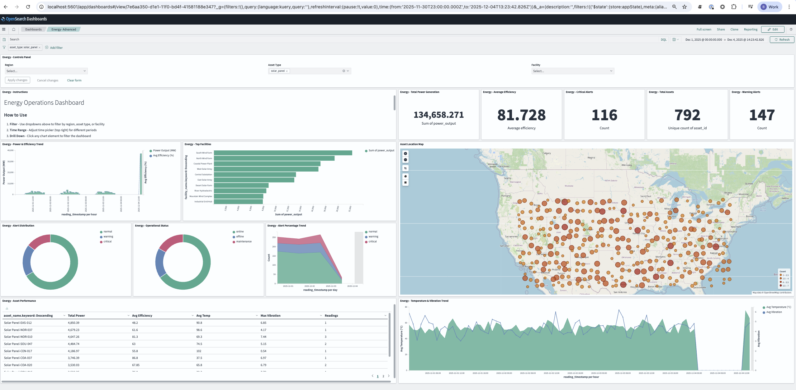

# Advanced OpenSearch Dashboards for Energy Sector

**Build a Complete Operations Control Center**



---

## Overview

This guide walks you through building advanced dashboards for energy operations. We focus on **10 essential visualizations** that provide complete operational visibility.

---

## Prerequisites

1. **OpenSearch** running with the `energy-sensor-readings` index  
   - **Managed (recommended):** Use **IBM watsonx.data managed OpenSearch**; set `OPENSEARCH_URL`, `OPENSEARCH_USERNAME`, and `OPENSEARCH_PASSWORD` in your environment.  
   - **Docker:** Run OpenSearch via Docker Compose (see [OpenSearch for Energy Sector](opensearch.md)).
2. **Index pattern created** for `energy-sensor-readings` with `reading_timestamp` as time field
3. **Sample data loaded** (run `python3 scripts/generate_sample_data.py`; same env vars apply)

---

## Part 1: Controls Panel

Interactive filters that control the entire dashboard.

1. **Menu** → **Visualize** → **Create visualization**
2. Select **Controls**
3. Add three controls:

**Control 1: Region**

| Setting | Value |
|---------|-------|
| Control Type | `Options list` |
| Control Label | `Region` |
| Index Pattern | `energy-sensor-readings` |
| Field | `region` |
| Multiselect | ✓ Enabled |

Click **Add** to add another control.

**Control 2: Asset Type**

| Setting | Value |
|---------|-------|
| Control Type | `Options list` |
| Control Label | `Asset Type` |
| Field | `asset_type` |
| Multiselect | ✓ Enabled |

Click **Add** to add another control.

**Control 3: Facility**

| Setting | Value |
|---------|-------|
| Control Type | `Options list` |
| Control Label | `Facility` |
| Field | `facility_name.keyword` |
| Multiselect | ✓ Enabled |

4. Click **Apply changes**
5. **Save** → Name: `Energy - Controls`

---

## Part 2: KPI Metrics (3 Panels)

Large numbers showing key performance indicators.

### 2A: Total Power Generation

1. **Menu** → **Visualize** → **Create visualization**
2. Select **Metric**
3. Select index: `energy-sensor-readings`
4. Configure:

| Setting | Value |
|---------|-------|
| Aggregation | `Sum` |
| Field | `power_output` |
| Custom Label | `Total Power (MW)` |

5. In **Options** tab: Font Size: `60pt`
6. **Save** → Name: `Energy - Total Power`

---

### 2B: Average Efficiency

1. Create new **Metric** visualization
2. Configure:

| Setting | Value |
|---------|-------|
| Aggregation | `Average` |
| Field | `efficiency` |
| Custom Label | `Avg Efficiency (%)` |

3. **Save** → Name: `Energy - Avg Efficiency`

---

### 2C: Critical Alerts

1. Create new **Metric** visualization
2. Configure: Aggregation: `Count`
3. **Add filter** in query bar: `alert_level` is `critical`
4. **Save** → Name: `Energy - Critical Alerts`

---

## Part 3: Alert Distribution (Donut Chart)

Quick visual of system health status.

1. **Menu** → **Visualize** → **Create visualization**
2. Select **Pie**
3. Select index: `energy-sensor-readings`
4. Configure:

| Section | Setting |
|---------|---------|
| **Metrics** | Slice Size: `Count` |
| **Buckets** | Split Slices → Aggregation: `Terms`, Field: `alert_level`, Size: `5` |

5. Go to **Options** tab:
   - Check **Donut**
   - Check **Show Labels**

6. **Save** → Name: `Energy - Alert Distribution`

---

## Part 4: Power & Efficiency Trend (Dual-Axis)

The most valuable chart, showing power output with efficiency overlay.

1. **Menu** → **Visualize** → **Create visualization**
2. Select **Area**
3. Select index: `energy-sensor-readings`

**Step A: Configure Data Tab**

| Section | Setting |
|---------|---------|
| **Metrics** | Y-axis 1: Aggregation: `Sum`, Field: `power_output`, Custom Label: `Power Output (MW)` |
| **Metrics** | Click **Add Y-axis** → Aggregation: `Average`, Field: `efficiency`, Custom Label: `Avg Efficiency (%)` |
| **Buckets** | X-axis: Aggregation: `Date Histogram`, Field: `reading_timestamp`, Interval: `Hourly` |

**Step B: Configure Metrics & Axes Tab**

4. Click the **Metrics & Axes** tab

5. In **Y-axes** section, configure the first axis:

| Setting | Value |
|---------|-------|
| Position | `Left` |
| Title | `Power Output (MW)` |

6. Click **+** to add second Y-axis:

| Setting | Value |
|---------|-------|
| Position | `Right` |
| Title | `Efficiency (%)` |

7. At the top, set **Line mode** to `Straight` for the efficiency line

8. Click **▶ Apply changes**

9. **Save** → Name: `Energy - Power & Efficiency Trend`

---

## Part 5: Top Facilities (Horizontal Bar)

Ranking of best-performing facilities.

1. **Menu** → **Visualize** → **Create visualization**
2. Select **Horizontal Bar**
3. Select index: `energy-sensor-readings`
4. Configure:

| Section | Setting |
|---------|---------|
| **Metrics** | Y-axis: Aggregation: `Sum`, Field: `power_output` |
| **Buckets** | X-axis: Aggregation: `Terms`, Field: `facility_name.keyword`, Size: `10`, Order: `Descending` |

5. **Save** → Name: `Energy - Top Facilities`

---

## Part 6: Asset Performance Table

Detailed view of all assets with key metrics.

1. **Menu** → **Visualize** → **Create visualization**
2. Select **Data Table**
3. Select index: `energy-sensor-readings`
4. Configure:

**Metrics** (add each one):

| Aggregation | Field | Custom Label |
|-------------|-------|--------------|
| Sum | `power_output` | Total Power |
| Average | `efficiency` | Avg Efficiency |
| Average | `temperature` | Avg Temp |
| Max | `vibration_level` | Max Vibration |
| Count | - | Readings |

**Buckets**:

| Setting | Value |
|---------|-------|
| Split Rows | Aggregation: `Terms`, Field: `asset_name.keyword`, Size: `20` |

5. **Save** → Name: `Energy - Asset Performance`

---

## Part 7: Asset Locations Map

Geographic view of all energy assets.

1. **Menu** → **Visualize** → **Create visualization**
2. Select **Coordinate Map**
3. Select index: `energy-sensor-readings`
4. Configure:

| Section | Setting |
|---------|---------|
| **Metrics** | Value: Aggregation: `Count` |
| **Buckets** | Geo Coordinates: Aggregation: `Geohash`, Field: `location`, Precision: `4` |

5. Go to **Options** tab:

| Setting | Value |
|---------|-------|
| Map type | `Scaled Circle Markers` |
| Show Tooltip | ✓ Enabled |

6. **Save** → Name: `Energy - Asset Map`

> **Tip**: Zoom out to see all US locations (data is lat 30-45, lon -75 to -120)

---

## Part 8: Dashboard Instructions (Markdown)

Help text for dashboard users.

1. **Menu** → **Visualize** → **Create visualization**
2. Select **Markdown**
3. Enter:

```markdown
## Energy Operations Dashboard

### How to Use
1. **Filter** - Use dropdowns above to filter by region, asset type, or facility
2. **Time Range** - Adjust time picker (top right) for different periods
3. **Drill Down** - Click any chart element to filter the dashboard

### Alert Levels
| Level | Action |
|-------|--------|
| 🟢 Normal | No action needed |
| 🟡 Warning | Monitor closely |
| 🔴 Critical | Immediate attention |

### Thresholds
- **Temperature**: Critical > 85°C
- **Vibration**: Critical > 7 mm/s
- **Efficiency**: Poor < 70%
```

4. **Save** → Name: `Energy - Instructions`

---

## Part 9: Assemble the Dashboard

Now bring all 10 visualizations together.

1. **Menu** → **Dashboard** → **Create dashboard**
2. Click **Add** and select each visualization:

**Layout Guide:**

| Row | Panels | Width |
|-----|--------|-------|
| 1 | Energy - Controls | 8/12 |
| 1 | Energy - Instructions | 4/12 |
| 2 | Energy - Total Power | 3/12 |
| 2 | Energy - Avg Efficiency | 3/12 |
| 2 | Energy - Critical Alerts | 2/12 |
| 2 | Energy - Alert Distribution | 4/12 |
| 3 | Energy - Power & Efficiency Trend | 12/12 |
| 4 | Energy - Top Facilities | 6/12 |
| 4 | Energy - Asset Map | 6/12 |
| 5 | Energy - Asset Performance | 12/12 |

3. **Drag and resize** panels to match the layout
4. Set time filter: **Last 7 days**
5. Click **Save** → Name: `Energy Operations Control Center`

---

## Part 10: Final Touches

### Enable Auto-Refresh

For real-time monitoring:
1. Click the time picker (top right)
2. Click **Auto-refresh**
3. Select interval: `30 seconds` for ops, `5 minutes` for overview

### Save Time with Dashboard

1. When saving, check **Store time with dashboard**
2. This preserves your time filter settings

### Share with Team

1. Click **Share** in the dashboard toolbar
2. Options:
   - **Permalink** - Direct link to this view
   - **Embed** - iFrame for other applications
   - **PDF/PNG** - For reports


---

## Resources

- [OpenSearch Dashboards Documentation](https://opensearch.org/docs/latest/dashboards/)
- [Main OpenSearch Guide](opensearch.md)
